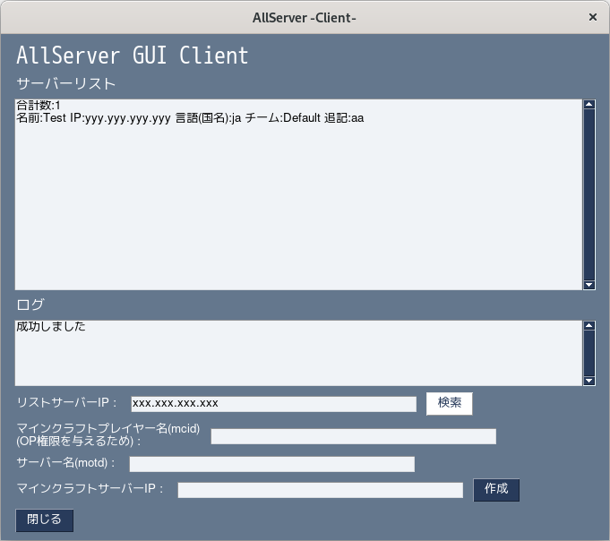
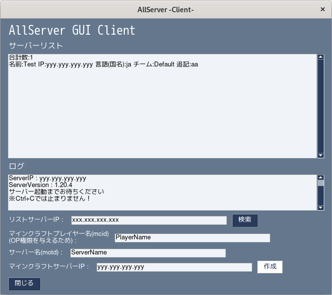

# マニュアル
まずAllServerを立ち上げてからこの工程をご覧ください
## サーバーを検索
検索するにはリストサーバーのIPを知っている必要があります
公式のリストサーバー : st-allserver.f5.si
もし、あなたがマインクラフトサーバーIPを知っていて作成したい場合はそのまま作成の項目をご覧ください
1. リストサーバーのIPを入力します
2. 検索します

## サーバーの作成
作成するにはマインクラフトサーバーのIPを知っている必要があります
知らない場合は"サーバーを検索"を見てください
1. マインクラフトのユーザー名(MCID)を入力します(OP権限が使えるユーザーを入力してください)
2. マインクラフトサーバーの名前(MOTD)を入力します
3. マインクラフトサーバーのIPを入力します
4. 作成ボタンを押します
5. 停止するにはマインクラフト上で/stopコマンドを実行するか、サーバー起動から一時間が経過したら、自動で止まります

